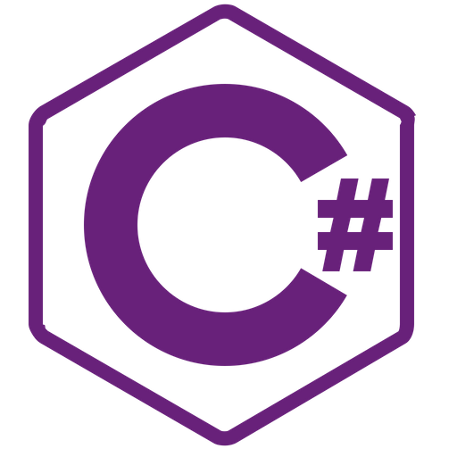
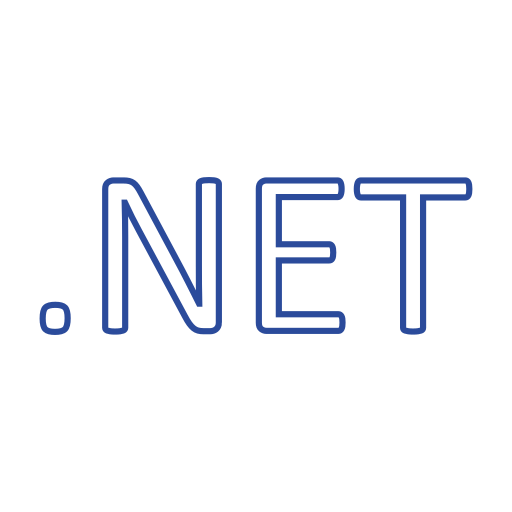

<!--
**Ko-dany/Ko-dany** is a ✨ _special_ ✨ repository because its `README.md` (this file) appears on your GitHub profile.

Here are some ideas to get you started:

- 🔭 I’m currently working on ...
- 🌱 I’m currently learning ...
- 👯 I’m looking to collaborate on ...
- 🤔 I’m looking for help with ...
- 💬 Ask me about ...
- 📫 How to reach me: ...
- 😄 Pronouns: ...
- ⚡ Fun fact: ...
-->

<h3 align="center">👋 Nice to Meet You! 👋</h3>

  
Based on Waterloo, ON, Canada 🍂

  
Co-op available from Sep,2024 - Aug,2025 🌱

  
I love inspiration 💓

 
<h3 align="center">✨ My Skills ✨</h3>

  <!-- Languages -->
  </a>&nbsp 
  </a>&nbsp 
  </a>&nbsp 
<!--   </a>&nbsp -->
  </a>&nbsp 

  <!-- Framework & Library -->
   
  </a>&nbsp 
  </a>&nbsp 
  </a>&nbsp
  </a>&nbsp 
<!--  </a>&nbsp -->

  <!-- Others -->
   
  </a>&nbsp 
  </a>&nbsp 
  </a>&nbsp

 
<h3 align="center">🐌 Let's Connect 🐌</h3>

  &nbsp
  <!--&nbsp-->
  

  
<!--

  

-->

<!-- May/May not be used in the future -->
<!---->

<!---->

<!--
- 🎓 I'm currently in 2nd year of Computer Programming & Analysis at Conestoga College.
- 💻 I'm learning **C#**, **JavaScript**,**Python** and **Java**.
- 📓 I use **ASP.NET Core**, **React.js**, **Flask** and **MySQL**.
- ✨ I'm looking for a co-op opportunity **starting from May 2024, with 4-16 months** of flexibility.
- 😆 I enjoy rock climbing and watching tv shows.

### **Contact Information:**
-->

<!--📫 <a href="https://ko-dany.github.io/" target="_blank" rel="noopener noreferrer">My Website</a>
 
🔗 <a href="https://www.linkedin.com/in/dahyun-dany-ko/" target="_blank" rel="noopener noreferrer">LinkedIn</a>
 
📧 <a href="mailto:iamgo910@gmail.com">iamgo910@gmail.com</a>

### **Languages and Tools:**

<html>
  

    
    
    
    
    
    
    
            
    
  

</html>
-->

